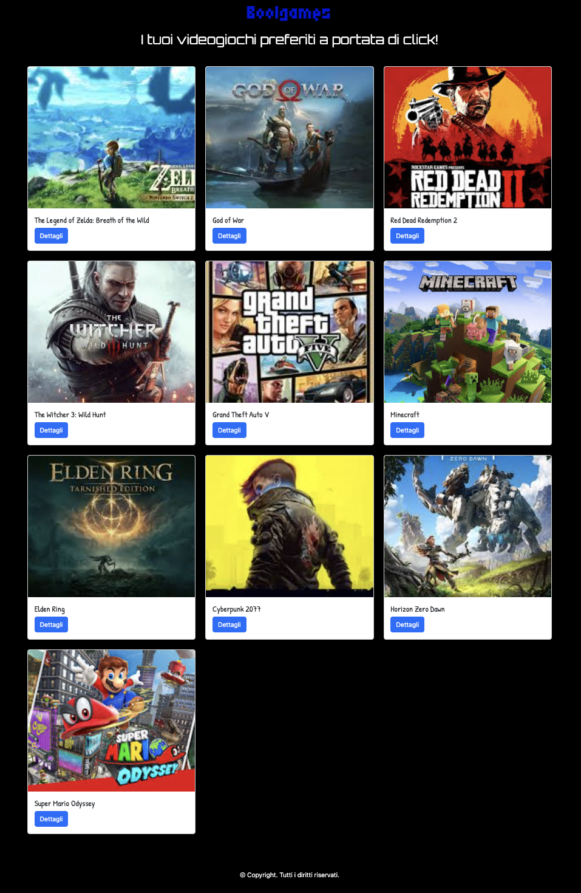

# Videogame Collection

Questo progetto è il frontend della web-app per la gestione di una raccolta di videogiochi. Utilizza React per creare un'interfaccia utente dinamica e interattiva.

## ⚙️ Tecnologie utilizzate
- React
- Axios (per comunicazione API)
- React Router DOM
- CSS Modules
- Vite

## 🎮 Funzionalità principali
- Visualizzazione dei giochi in card con immagine
- Dettaglio del singolo gioco cliccando su una card
- Comunicazione asincrona con le API Laravel

## 📁 Struttura del progetto
- `src/pages`: Pagine principali (Home, GameDetail)
- `src/App.jsx`: Routing principale
- `src/layout` : Layout dell'app

